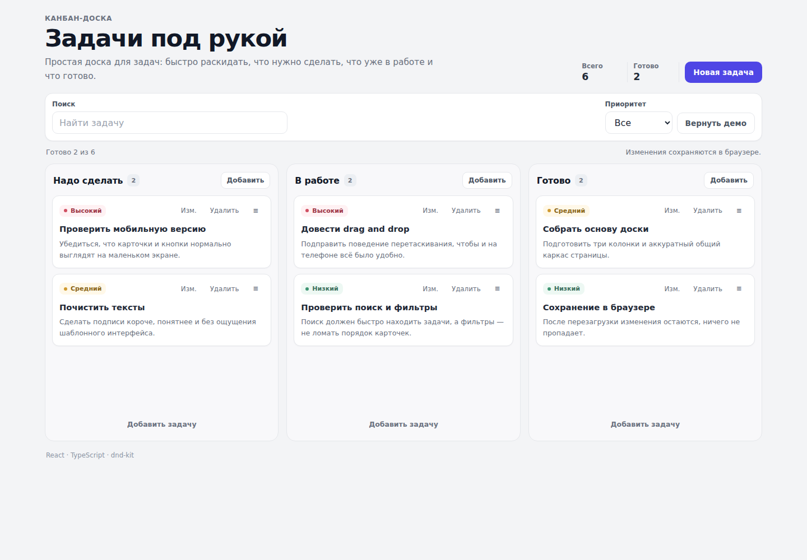

# Kanban Board

Минималистичная доска для задач с удобным drag and drop на компьютере и телефоне.

**[Открыть демо](https://deazi.gitlab.io/kanban-board/)** · **[GitHub](https://github.com/Superdeazi2/kanban-board)** · **[GitLab](https://gitlab.com/Deazi/kanban-board)** · **[Скачать ZIP](https://github.com/Superdeazi2/kanban-board/archive/refs/heads/main.zip)**



## Возможности

- три колонки: «Надо сделать», «В работе» и «Готово»;
- создание, редактирование и удаление задач;
- перетаскивание карточек внутри колонки и между колонками;
- отдельное поведение drag and drop для мыши, touch и клавиатуры;
- поиск по задачам и фильтр по приоритету;
- сохранение изменений в localStorage;
- адаптивная версия для телефона.

## Мобильная версия


## Стек

React, TypeScript, Vite, dnd-kit, CSS, localStorage.

## Локальный запуск

```bash
npm install
npm run dev
```

Проверка production-сборки:

```bash
npm run lint
npm run build
```
